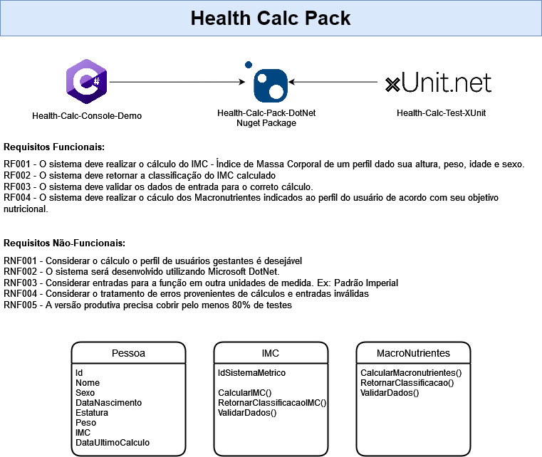

# health-calc-pack-dotnet
## Curso de Pós-Graduação em Engenharia de Software da PUC-MG

### Disciplina Projeto Integrado em Engenharia de Software

Objetivo: 

Uma biblioteca que permite cálculo de IMC e Macronutrientes, baseados nos dados inseridos pelo usuário.

# Utilização / Versionamento:

###**Version: 1.0.0:**
 
 *Instanciar um novo objeto do tipo IMC para em seguida utilizar os métodos disponíveis na versão:* 

### Methodos disponiveis > 
- Calc (Responsável por retornar o numero IMC)
  - Parâmetros: Altura(Tipo Double) e Peso(Tipo Double)
  - Exemplo return Double RetornoIMC = ObjectIMC.Calc(Altura ,Peso);
- IsValidData (Responsável validar os dados informados)
  - Parâmetros: Altura(Tipo Double) e Peso(Tipo Double)
  - Exemplo: return bool RetornoIMC = ObjectIMC.IsValidData(Altura,Peso);
- GetIMCClass (Responsável por retornar a classe que o individuo se encontra)
  - Parâmetros: IMC(Double)
  - Exemplo: return string RetornoIMC = ObjectIMC.GetIMCClass(IMC);

###**Version: 2.0.0:**
- Adição do cálculo de Macronutrientes;
  - Parâmetros: Altura(Tipo Double), Peso(Tipo Double), Sexo(Enum), NivelAtividadeFisica(Enum) e ObjetivoFisico(Enum).
- IsValidData (Responsável validar os dados informados)
  - Parâmetros: Peso(Tipo Double)

# Arquitetura

# Tecnologias Utilizadas

- IDE

  - [Visual Studio](https://visualstudio.microsoft.com/pt-br/downloads/)

- Framework

  - .NET 6.0

- Testing

  - [XUnit.net](https://xunit.net/)

- Distribuição

  - [NuGet](https://www.nuget.org/)